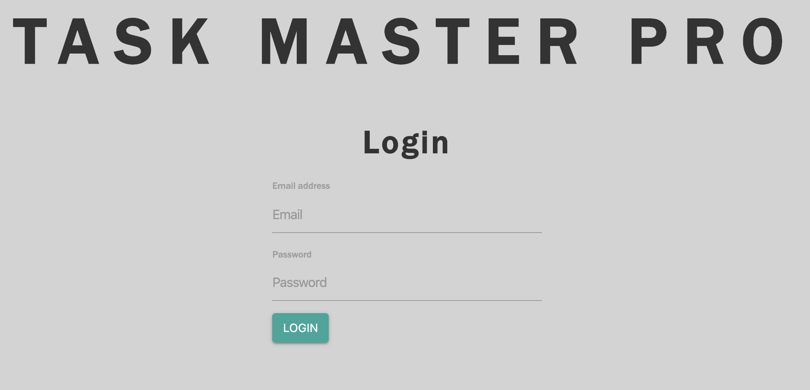
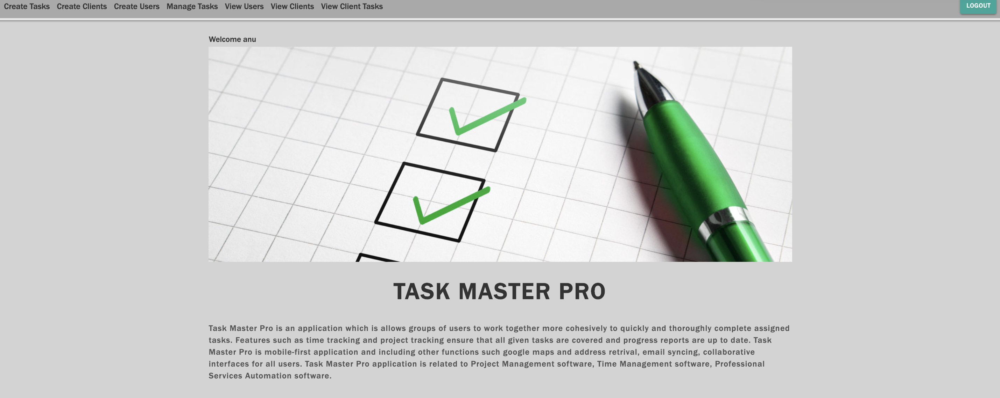

# TASK MASTER PRO

 Task Master Pro is an application which is  allows groups of users to work together more cohesively to quickly and thoroughly complete assigned tasks. Features such as time tracking and project tracking ensure that all given tasks are covered and progress reports are up to date. Task Master Pro is mobile-first application and including other functions such google maps and address retrival, email syncing, collaborative interfaces for all users. Task Master Pro application is related to Project Management software, Time Management software, Professional Services Automation software. 

<H4> Technologies Used </H4>

 Application build with JavaScript, NodeJs Express Mysql Bootstrap and Materialize 

<H4> Login Page </H4>

<H4> Home Page </H4>

<H4> Task Assign Page </H4>

Heroku Repository  https://taskmasterpro.herokuapp.com

GIT Repository  https://github.com/anu-dam/TMC

<H4> Authors </H4>

Jameskutty Sebastian

Chandu Koritala

Anu Dambaladeniya

